# The Big Mach

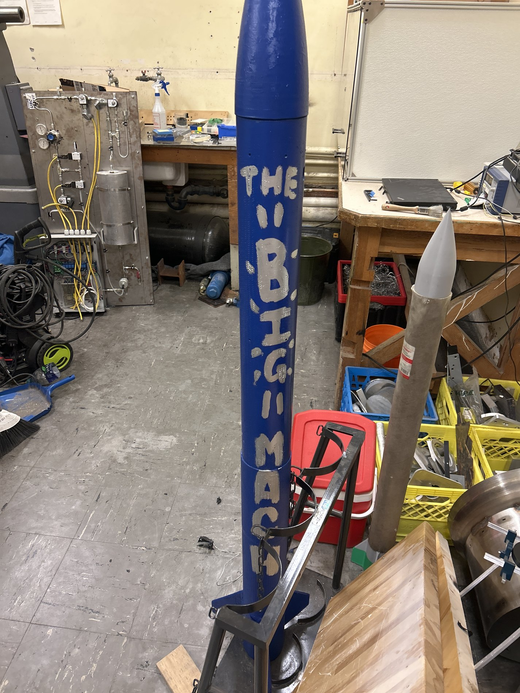

*The Big Mach at the end of the build, in the UBC Rocket workshop. The bare grey
PA6GF nose cone on the right is a spare print of the same part.*

---

## What it is

The Big Mach is a UBC Rocket **test vehicle**. It exists so that two pieces of new
hardware, a reefing parachute recovery system and an in-house avionics stack, could be
flown and characterised on something the team controlled end to end, rather than risking
them on the competition rocket.

That framing drives every design decision on the vehicle. It has to fly high and fast
enough to be a meaningful test, it has to separate reliably to give the recovery system
a chance to work, and the avionics bay has to be accessible enough that another sub-team
can service their own hardware inside it.

From the OpenRocket model (`FINAL_L935_BIG_MACH_with_centering rings.ork`):

| Parameter | Value |
|---|---|
| Length | 146 cm |
| Max diameter | 10.7 cm |
| Mass, no motors | 5176 g |
| Mass, with motors | 7718 g |
| Motor configuration | `3147L935-P` (L-class, 935 N average) |
| Stability margin | 1.5 cal (11%), CG 79.2 cm / CP 95.3 cm |
| Simulated apogee | 3064 m |
| Simulated max velocity | 347 m/s, **Mach 1.028** |
| Simulated max acceleration | 195 m/s² |

The name is not decoration: the simulation puts the vehicle just over Mach 1, which is
what the airframe and fin design had to survive.

<table>
<tr>
<td width="50%">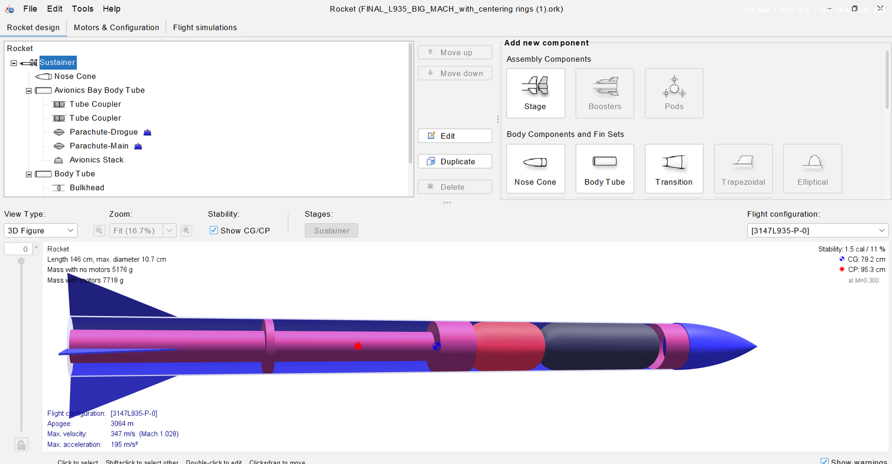</td>
<td width="50%">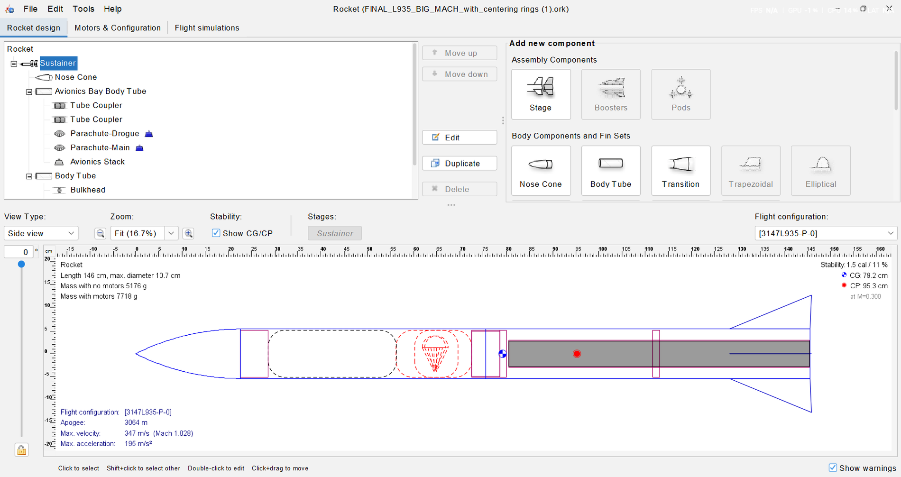</td>
</tr>
<tr>
<td colspan="2"><em>OpenRocket model. The side view shows the internal stack (nose cone, avionics bay with drogue and main parachutes either side of the avionics stack, coupler, then the motor body tube) and the CG/CP markers used to check the stability margin.</em></td>
</tr>
</table>

---

## My role

I was one of three people on the test-rocket sub-team. The sub-team designed and built
the vehicle; the recovery, avionics, embedded software and composites sub-teams supplied
the payload hardware and the expertise. A lot of the job was translation: taking a
requirement from another sub-team and turning it into something that could actually be
printed, laid up, or bolted in.

**What was mine:**

- **The full-vehicle SolidWorks assembly.** I built and mated `FullAssembly`: nose cone
  sections (`NoseconeTip`/`NoseConeMiddle`/`NoseconeBottom`), avionics bay body tube,
  motor body tube, inner tube, bulkheads, centering rings, the fin pattern
  (`LocalCirPattern1`) and the bottom plate.
- **OpenRocket modelling** for stability and trajectory.
- **3D printing.** The majority of the sub-team's printed prototypes and flight parts
  went through me, including the PA6GF (glass-filled nylon) nose cone.
- **Fiberglass wet layup** for the custom body tubes.
- **Avionics bay integration.** Fitting the flight computer stack, battery and charge
  wiring into the bay.
- **Separation charge design and ground testing.** Sizing and massing black powder
  charges, wiring e-matches, and firing them over a remote link.
- **Painting and finishing.**

**What was not mine:**

- The **avionics bay internal design** (`EDR_AVBAY_DESIGN` in the assembly tree) came
  from the avionics sub-team. I integrated it and built the structure around it. I did
  not design the flight computer or its sled.
- The **reefing parachute system** is the recovery sub-team's design. The Big Mach was
  the vehicle that carried it.
- The **composite layups and fin fabrication were done with the team.** I did the work
  alongside more experienced members, not alone. The photo captions in `media/build/`
  reflect this distinction as I recorded it at the time.

---

## Design

<table>
<tr>
<td width="50%">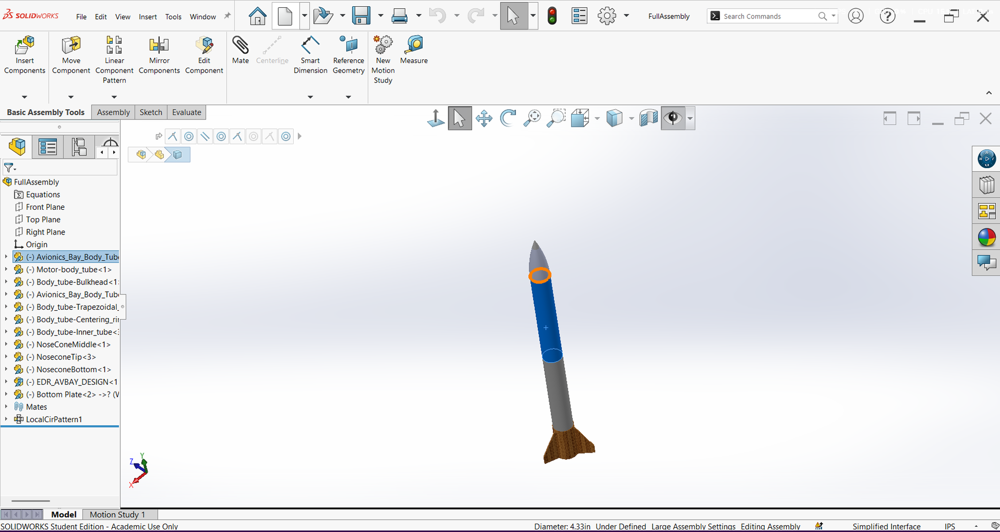</td>
<td width="50%">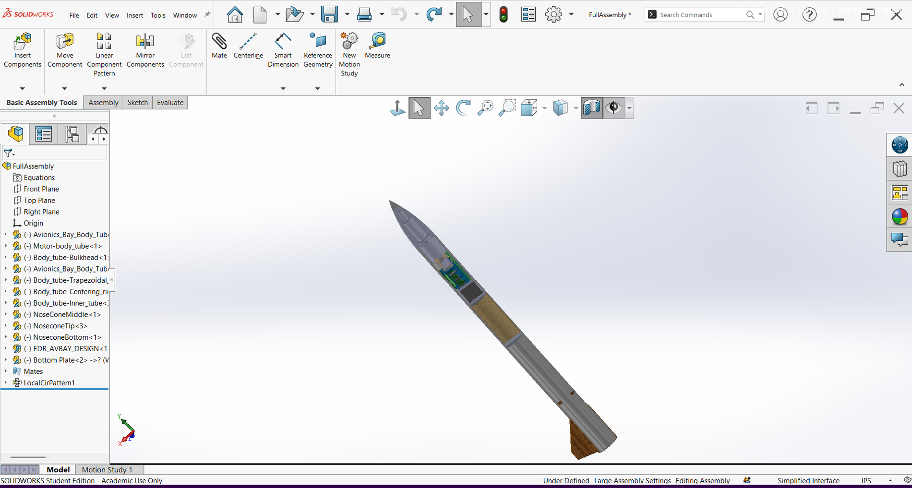</td>
</tr>
<tr>
<td colspan="2"><em>Left: the assembled vehicle in SolidWorks, with the component tree showing the parts I mated. Right: the same model sectioned, exposing the avionics stack inside the bay. This is the view that mattered when checking that the avionics sub-team's hardware and the recovery hardware could physically coexist in one bay.</em></td>
</tr>
</table>

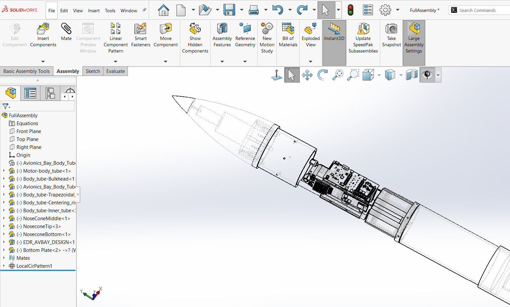

*Nose cone and avionics bay, hidden-line view. The avionics bay is the shoulder section
behind the cone; the recovery hardware packs either side of the electronics.*

> **Full assembly available.** The complete SolidWorks assembly (37 files, 205 MB
> uncompressed) is published as a
> [release asset](https://github.com/BentoOre0/2025-2026-UBC-ROCKET-work/releases/tag/cad-v1).
> Start at `FullAssembly.SLDASM`. The avionics bay, backplane, connector and pyro board
> assemblies inside it belong to the avionics sub-team; the airframe and the top-level
> mating are mine.

---

## Manufacturing

<table>
<tr>
<td width="50%">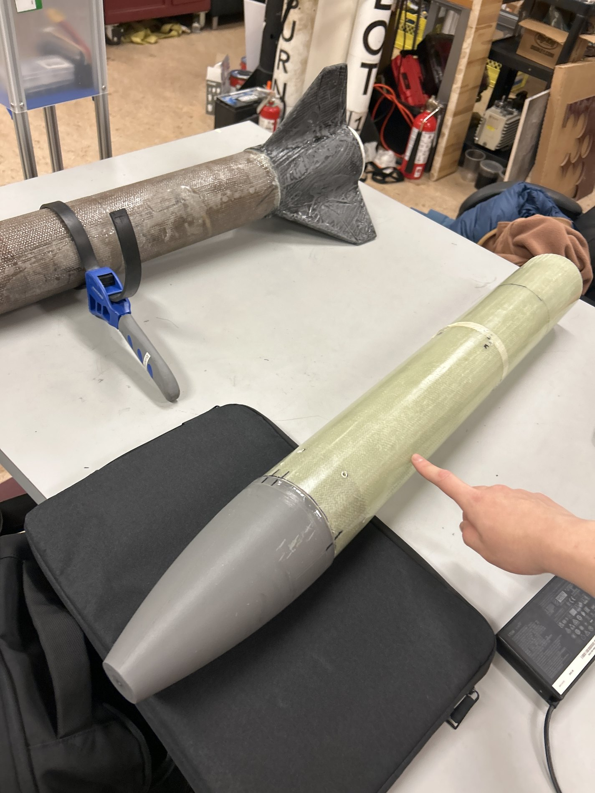</td>
<td width="50%">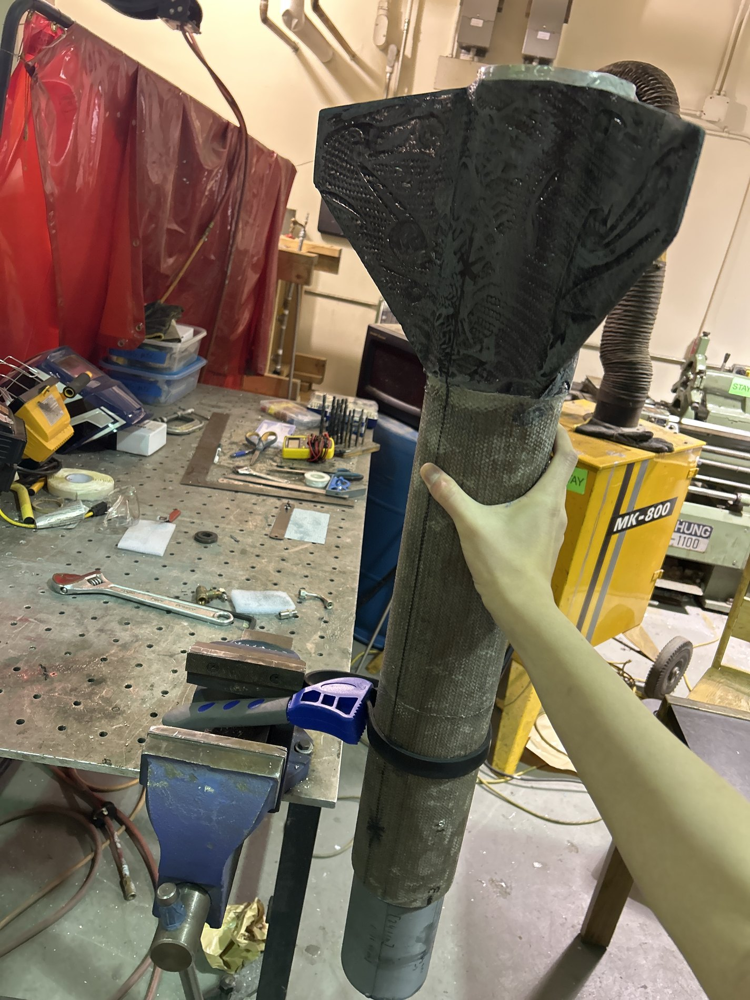</td>
</tr>
<tr>
<td colspan="2"><em>Left: the PA6GF nose cone I printed, next to the green fiberglass body tube. PA6GF (glass-filled nylon) was chosen over a standard print material because the cone sees the highest aerodynamic heating and stagnation pressure on the vehicle. Right: the composite airframe and a carbon fibre fin during fin fabrication: fiberglass and phenolic in the tube, carbon in the fins.</em></td>
</tr>
</table>

<table>
<tr>
<td width="33%">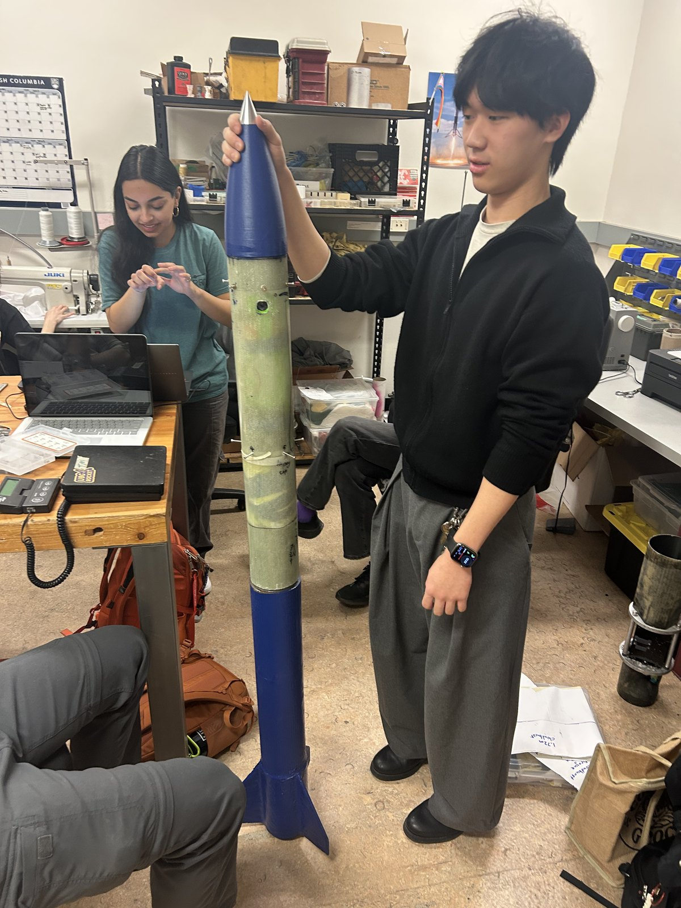</td>
<td width="33%">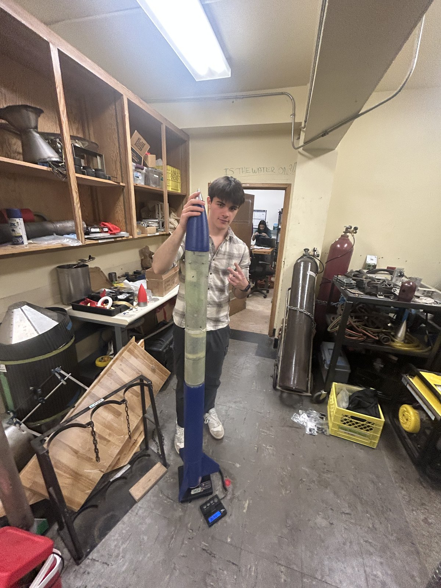</td>
<td width="33%">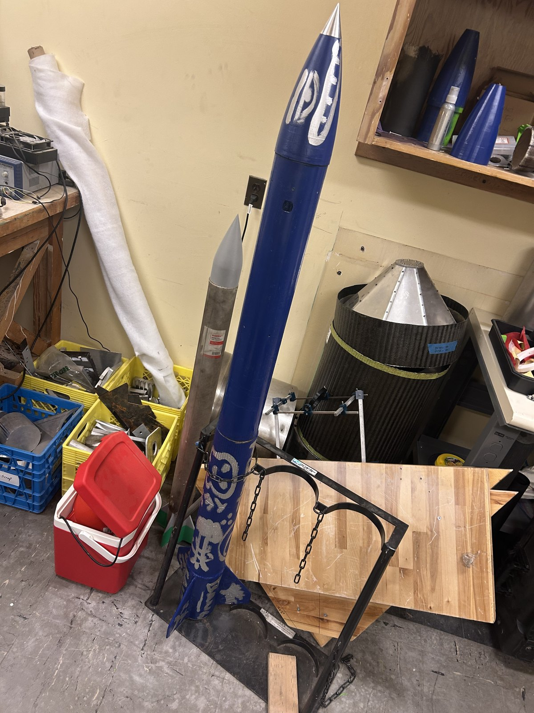</td>
</tr>
<tr>
<td colspan="3"><em>Build progress in the UBC Rocket workshop. Left: airframe going together, with the bare composite section still unpainted. Middle and right: the vehicle standing complete, alongside the team's other airframes and nose cones.</em></td>
</tr>
</table>

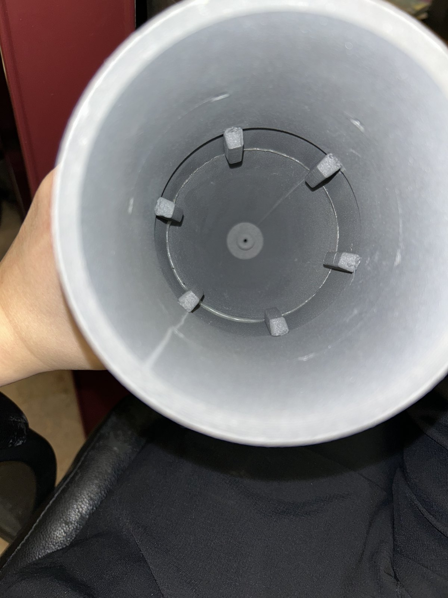

*Looking down the airframe at the motor tube, held concentric inside the body tube by a
centering ring, with printed blocks spaced around the annulus.*

### The layup diameter mismatch

The most instructive manufacturing problem on this project was a **diameter mismatch on
the first fiberglass wet layup**. The tube we produced did not come out at a diameter
that mated correctly with the parts it had to meet, so the layup had to be reworked and
re-run rather than salvaged.

The lesson that actually stuck is that on a wet layup the mandrel is not the only thing
setting the finished diameter. Layer count, resin uptake and how hard the tube is
compacted all stack into the final wall thickness, and a coupler fit that is toleranced
tightly on paper has very little room to absorb that. The fix was to treat the layup
schedule as something to be designed against a target *finished* inside diameter and
verified, rather than assumed from the mandrel.

> **Evidence note.** I have no photograph of the mismatched tube itself, and no written
> record of the measured error. This section is from memory. The composite work that is
> documented here is the successful second attempt and the fin fabrication.

---

## Fin flutter analysis

A fin that flutters shakes itself apart. The fins had to survive a vehicle that the
simulation puts just over Mach 1, so before committing to the fin design I needed to know
the speed at which bending-torsion flutter would start, and confirm the vehicle never
reaches it.

I used the flutter criterion from **NACA TN 4197 (Equation 18)**, the standard closed-form
prediction for low aspect ratio solid fins tapered toward the tip:

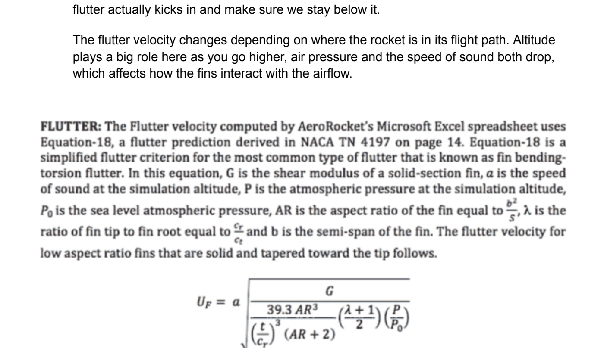

`a` is the speed of sound at altitude, `G` the shear modulus of the fin, `AR` the aspect
ratio, `λ` the tip-to-root chord ratio, `t/c_r` the thickness ratio, and `P/P0` the
pressure ratio against sea level. Because `a` and `P` both fall with altitude, flutter
speed is not a single number: it has to be evaluated along the whole trajectory. I pulled
altitude, local speed of sound and vehicle Mach number from the OpenRocket simulation and
evaluated the criterion at each point.

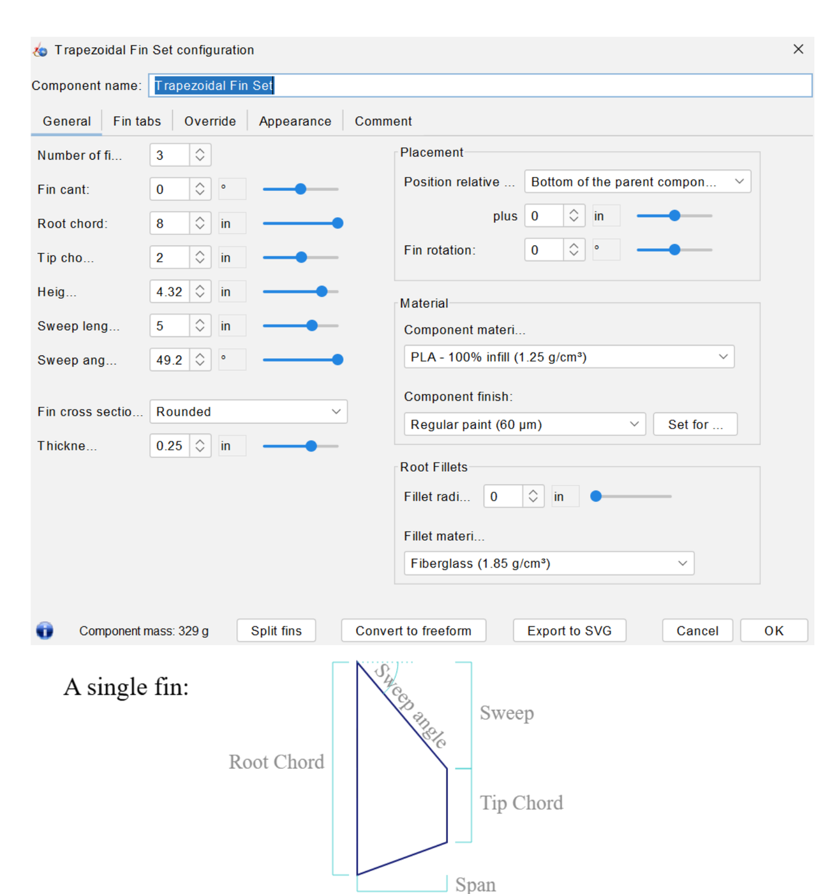

*The fin set as defined in OpenRocket, and the parameters the flutter criterion consumes.
These are the numbers that go into the equation above.*

Fin geometry, taken from the CAD model and the OpenRocket trapezoidal fin set:

| Parameter | Value |
|---|---|
| Number of fins | 3 |
| Root chord | 8 in |
| Tip chord | 2 in |
| Semi-span (height) | 4.32 in |
| Sweep length / angle | 5 in / 49.2 deg |
| Thickness | 0.25 in, rounded cross section |
| Fin cant | 0 deg |
| Material | PLA, 100% infill (1.25 g/cm^3) |
| Fin set mass | 329 g |

**Result: flutter velocity runs about Mach 2.5 at sea level to Mach 2.9 at 2500 m, while
the vehicle peaks just under Mach 1.0 at roughly 500 m.**

<table>
<tr>
<td width="50%">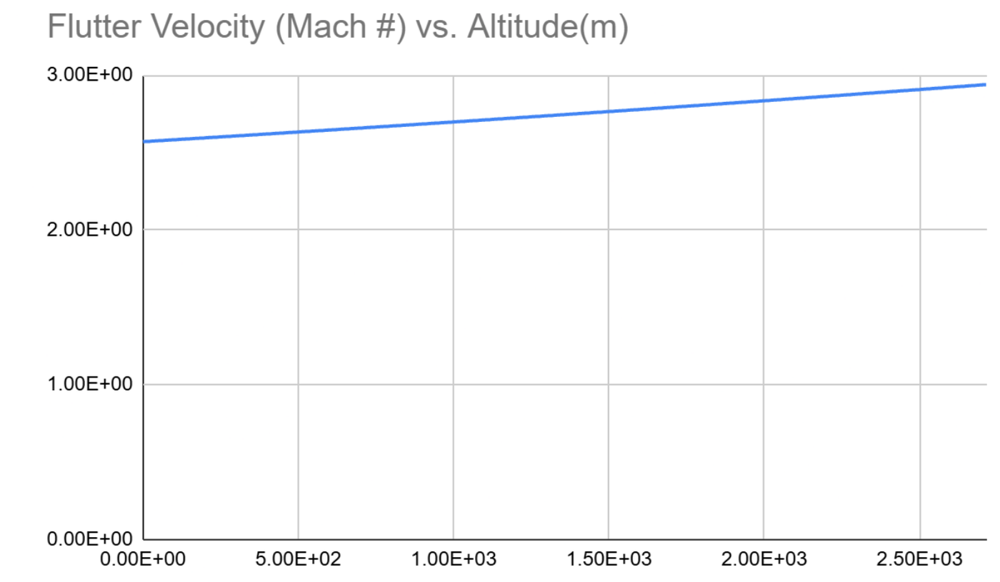</td>
<td width="50%">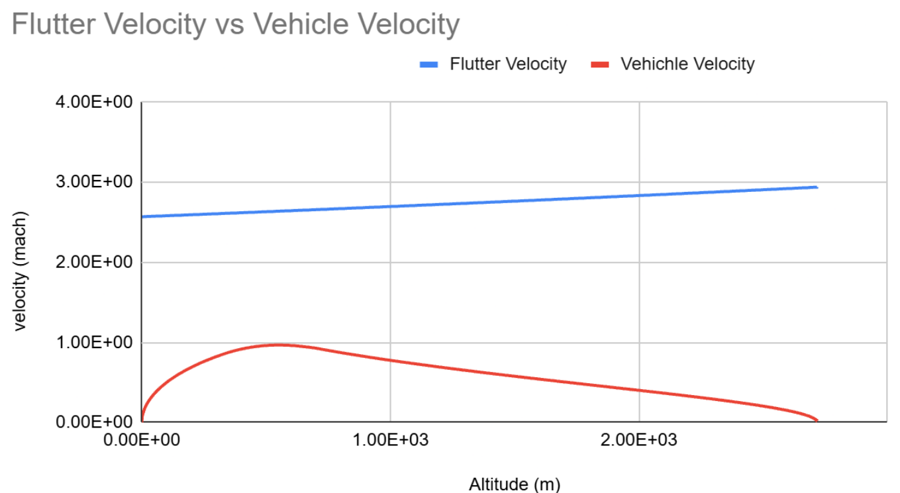</td>
</tr>
<tr>
<td><em>Flutter velocity rising with altitude, Mach 2.5 to 2.9.</em></td>
<td><em>The one that matters: flutter velocity (blue) against actual vehicle velocity (red) over the whole flight. The gap between the curves is the margin.</em></td>
</tr>
</table>

The right-hand plot is the whole point of the exercise. The red curve is the vehicle,
peaking just under Mach 1.0 early in the burn and bleeding off; the blue curve is the
speed at which the fins would start to flutter. They never come close to touching, so the
fin design was cleared on that basis.

> **Where this analysis is weak.** The shear modulus is the input the whole result hinges
> on, and I did not have a measured value for our actual fin material. I used a value
> assumed from fins I believed had similar properties, which I flagged in the team
> documentation at the time as the soft spot in the calculation. The honest way to close
> it is a deflection test on a real fin: apply a known force at the tip, measure the
> deflection, back out `G`. The margin here is large enough (roughly 2.5x) that a
> substantial error in `G` would not change the conclusion, which is the only reason the
> assumption was acceptable.

The flutter working, the fin dimensions and the resulting plots are in
[`fin-flutter-and-separation-testing-extract.pdf`](docs/fin-flutter-and-separation-testing-extract.pdf).

That document is a **collaborative team document** that I contributed to, not something I
wrote alone, and it is published here as an extract. The fin flutter analysis is the part
I can point to as my own work. Elsewhere in it I contributed without being able to draw a
clean line around which paragraphs are mine, so I am not going to claim the document
wholesale. The pages covering the black powder packing procedure are explicitly credited
to another sub-team and are left out entirely, along with the operational pages carrying
hardware credentials.

---

## Avionics integration

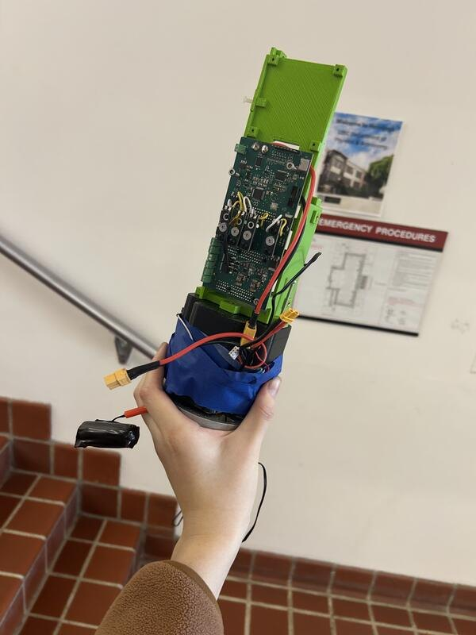

*The avionics bay stack out of the airframe: the flight computer boards on their printed
sled, screw-terminal blocks for the charge wiring, power leads and connectors, and the
battery strapped below. My work here was the physical integration: getting this stack,
its battery and its charge wiring to fit, mount and route inside the bay, and remain
serviceable by the avionics sub-team.*

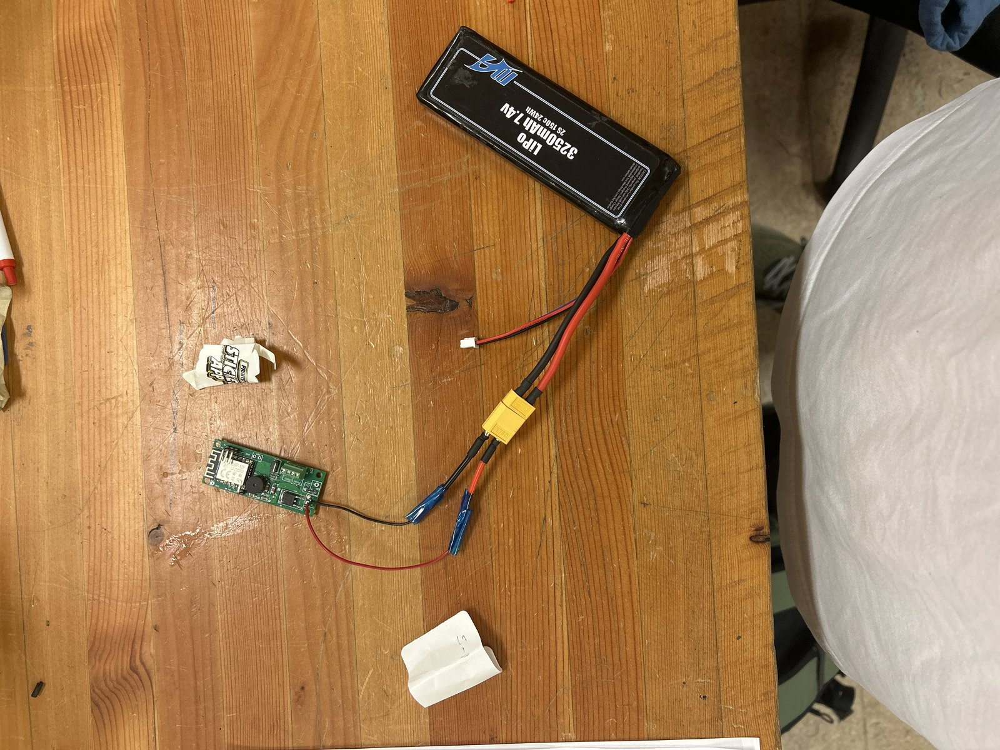

*Power and firing hardware on the bench before it went into the bay: a 2S LiPo (3250 mAh,
7.4 V, 24 Wh) on an XT60 lead, wired through to the Eggtimer board with its WiFi module
visible. The Eggtimer needs 2S/7.4 V, so the pack choice is set by the board. This is the
link between the battery and the e-match that fires the separation charge, and it is the
part of the electronics I was responsible for physically integrating.*

---

## Separation charge testing

Recovery on this vehicle depends on a black powder charge separating the airframe at the
right moment. Too little and the sections do not part; too much and you damage the
airframe or the parachute you are trying to deploy. The charge mass is not something you
can confidently calculate and walk away from. It gets massed out, fired, and watched.

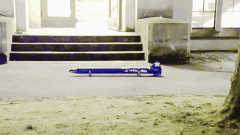

*A later test on the finished, painted vehicle, filmed at 120fps and slowed roughly 3x.
The charge fires, the airframe splits at the coupler, and the two sections push apart
with the shock cord paying out between them. Slowing it down is what makes it useful:
you can see whether the sections separate cleanly and stay tethered, rather than just
hearing a bang.*

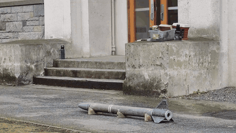

*An earlier test on the bare airframe, real time. Fired remotely, triggered from a phone
over a wireless link to the firing board and out to the e-match. Full resolution clip:
[`separation-charge-test.mp4`](media/testing/separation-charge-test.mp4).*

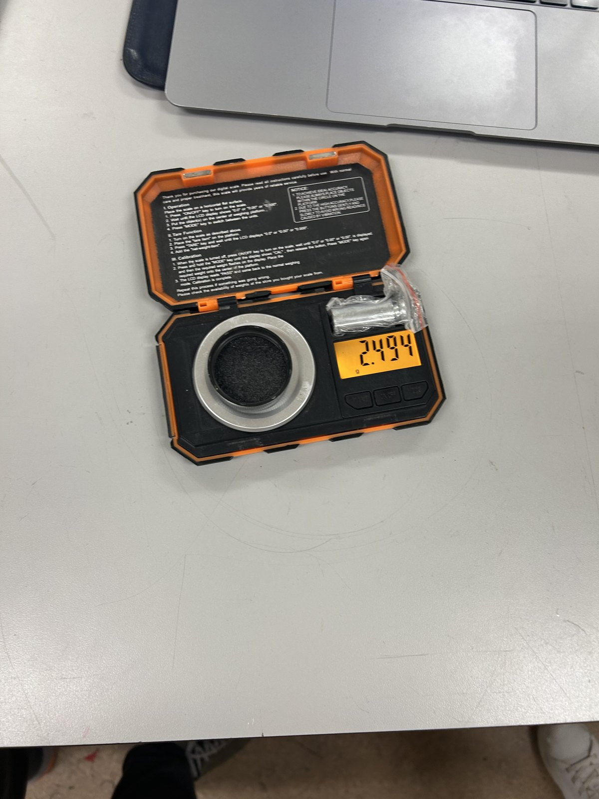

*Massing a charge on a jeweller's scale during test preparation. The reading is 2.494 g.
This is the measurement step the section above is about: the charge mass is set on a
scale, not estimated.*

**What I did:** designed and ground-tested the separation charges, using an **Eggtimer
Quantum** as the firing system and **e-match** ignition, iterating charge mass until the
recovery system deployed reliably. I worked with the team leads to estimate the starting
charge requirement, and debugged power and electronics faults that came up during testing.

### Finding the charge mass by bisection

The charge mass was not guessed at and it was not swept linearly. The procedure written up
for the team, and the one I ran, is a **binary search on charge mass**:

1. Fire one test at **1 g** and one at **2 g** to bracket the answer immediately.
2. If both are too weak, jump the bracket up to 3 g and 4 g.
3. If 1 g is too weak and 2 g works or overshoots, the answer is inside 1 to 2 g, so test
   **1.5 g** next.
4. Keep halving the interval until the charge lands on a clean, forceful separation.
5. Once a charge gives a consistent result, fire it **2 to 3 more times** to confirm it is
   repeatable rather than lucky.

The target is the *minimum* charge that separates cleanly every time: enough that it never
merely pops open, not so much that it damages the airframe or the parachute. Bracketing
and halving converges in **3 to 4 tests**, where a linear sweep would burn far more
hardware and far more range time to reach the same answer.

This is the part of the project I find easiest to explain to software people. It is a
binary search, run against a physical system where every probe costs a rebuild, a drive to
a test site and a finite supply of e-matches. The cost per iteration is what makes the
choice of search strategy matter.

> **Evidence note, read this before quoting numbers.** The hardware, the firing method and
> the bisection procedure are documented in the
> [extract above](docs/fin-flutter-and-separation-testing-extract.pdf). What is *not*
> recorded anywhere is the per-test result table: this repository holds no test log, so I
> cannot say from the record alone which charge mass finally flew. The photograph above
> evidences one charge being massed at 2.494 g, which sits inside the 1 to 4 g range the
> procedure works through, but whether it was an intermediate probe or the final answer is
> my recollection rather than a record. I have deliberately not invented numbers to fill
> that gap.

---

## Launch

Launching a high-power vehicle out of Vancouver means driving it to a site that will take
it. For this campaign that was Pasco, Washington: 603 km and about six and a quarter
hours from the Hennings Building on campus, across the border.

<table>
<tr>
<td width="50%"></td>
<td width="50%">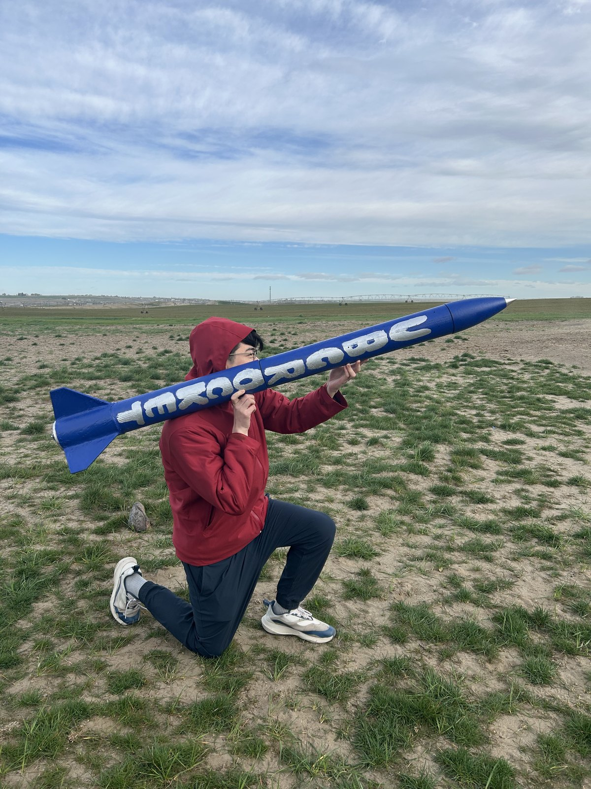</td>
</tr>
<tr>
<td><em>The drive. UBC Hennings Building to Pasco, WA: 603 km, 6 hr 14 min, one border crossing.</em></td>
<td><em>With the Big Mach at the launch site.</em></td>
</tr>
</table>

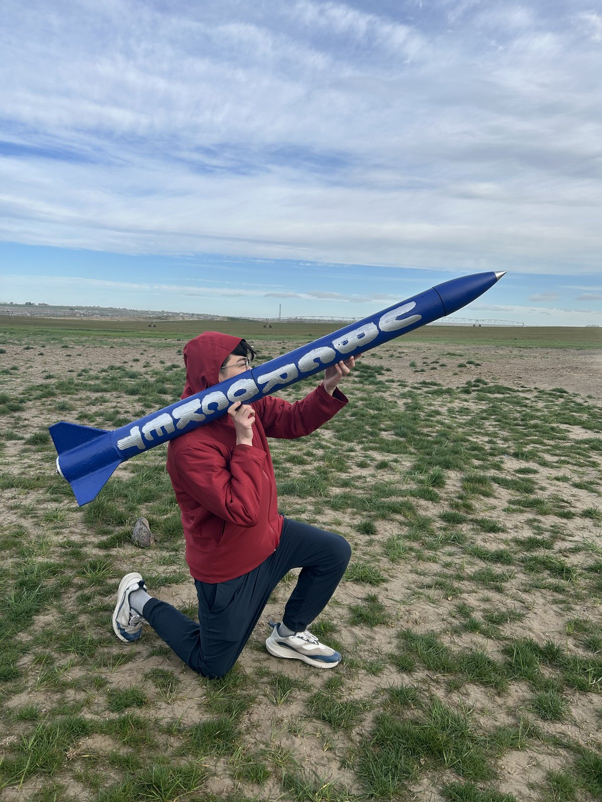

*The finished vehicle at the launch site.*

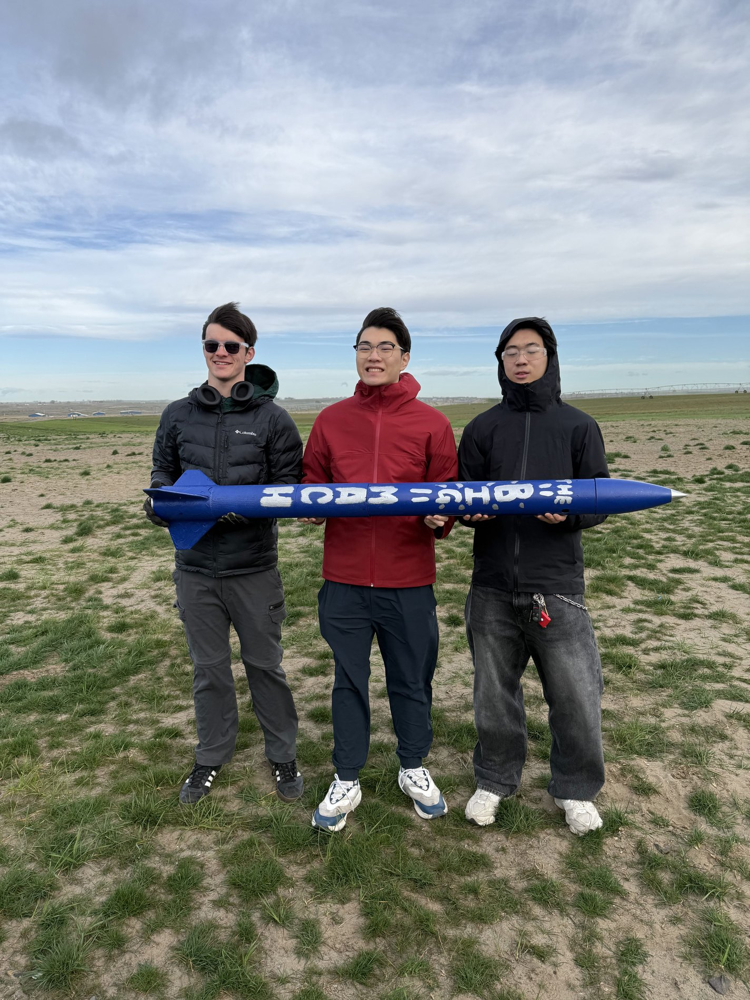

*At the launch site with the sub-team. It was extremely windy, which is the kind of thing
that decides whether a launch window happens at all. Our team lead is not in any of the
photos, only in the video from the same day:
[`launch-site-team-video.mp4`](media/launch/launch-site-team-video.mp4).*

---

## What I took away from it

**Ground testing energetics is not optional.** The charge mass that "should" work and the
charge mass that reliably separates a specific airframe, with a specific shear pin and
seal arrangement, are different numbers. There is no honest way to close that gap except
to mass a charge out on a scale, fire it, and watch what the airframe actually does. That
is why there is a photo of a jeweller's scale in this repository: the number came off an
instrument, not out of a formula, and it took more than one attempt to find it.

**Composite processes have tolerances that CAD does not.** The layup diameter mismatch
cost a full rework because we treated the layup as a way to realise a drawing rather than
as a process with its own variation. A mandrel sets a starting diameter. Layer count,
resin uptake and compaction set the finished one, and a coupler fit toleranced tightly on
paper has almost no room to absorb the difference. I now design a layup against a target
finished inside diameter and verify it, instead of inferring it from the tooling.

**Integration is a design constraint, not a final step.** The avionics bay had to be
serviceable by people who were not me, working on hardware I did not design and would not
be there to explain. That requirement changed the geometry: access, fastener choice and
routing all got decided by someone else's workflow rather than by what was easiest to
model. Designing for another team's hands is a different problem from designing for your
own.

**Most of the job was translation.** I came in expecting the work to be CAD. What it
actually was, most weeks, was taking a constraint from recovery, avionics, embedded
software or composites, understanding enough of that sub-team's problem to know which
parts of the constraint were real and which were preference, and turning the result into
geometry someone could print or lay up. The vehicle was the easy part to draw. Knowing
what it had to be was the work.
