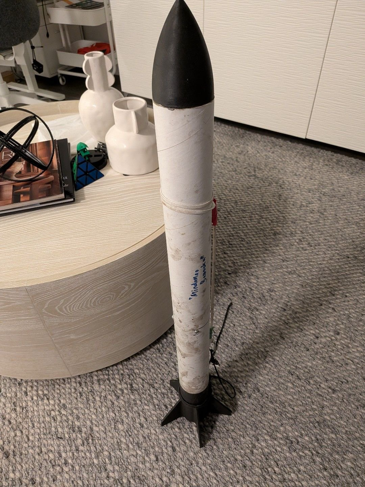
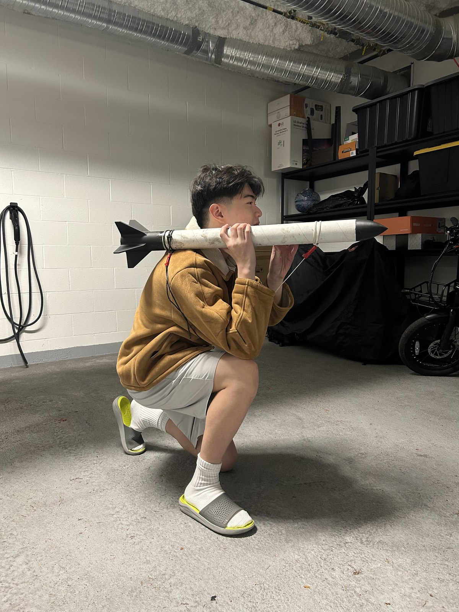
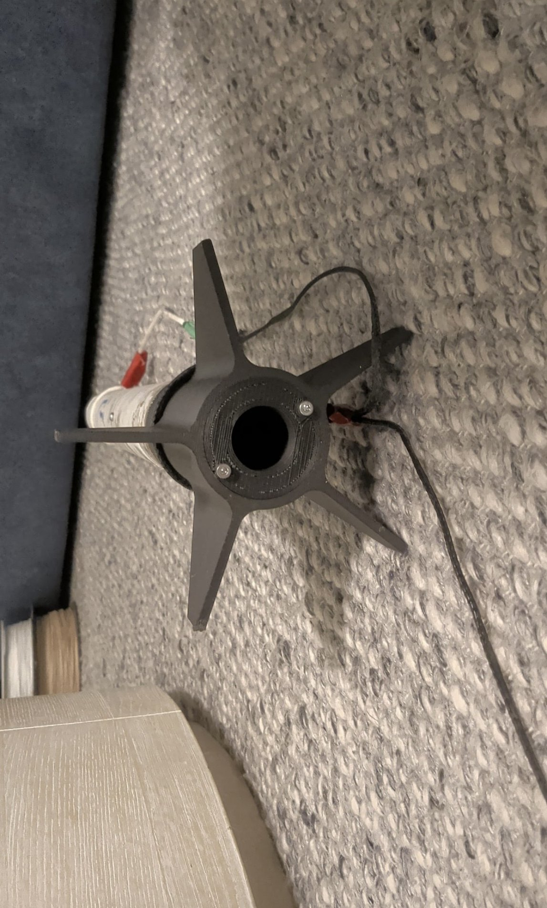
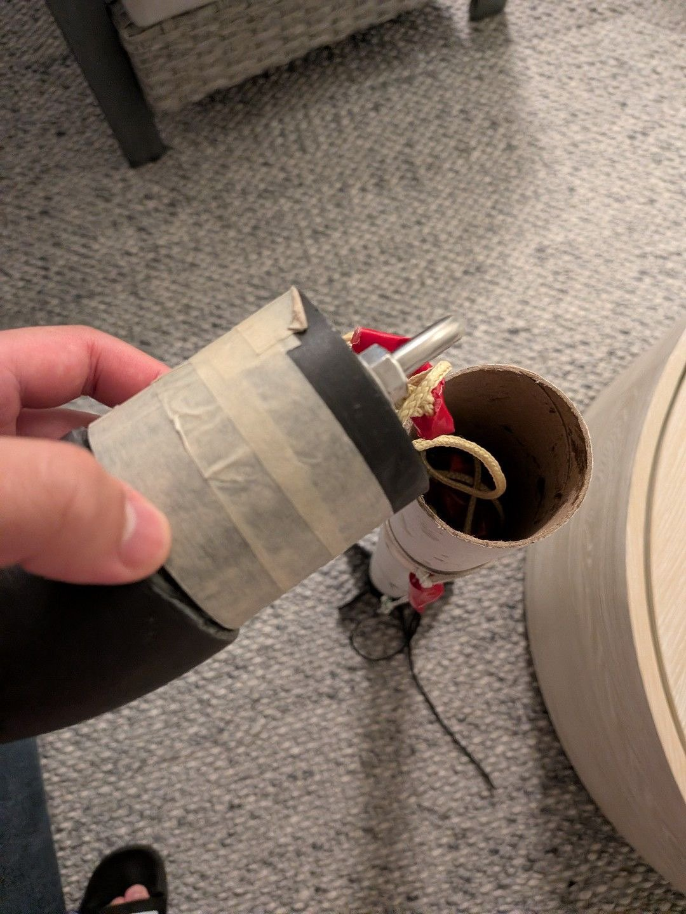
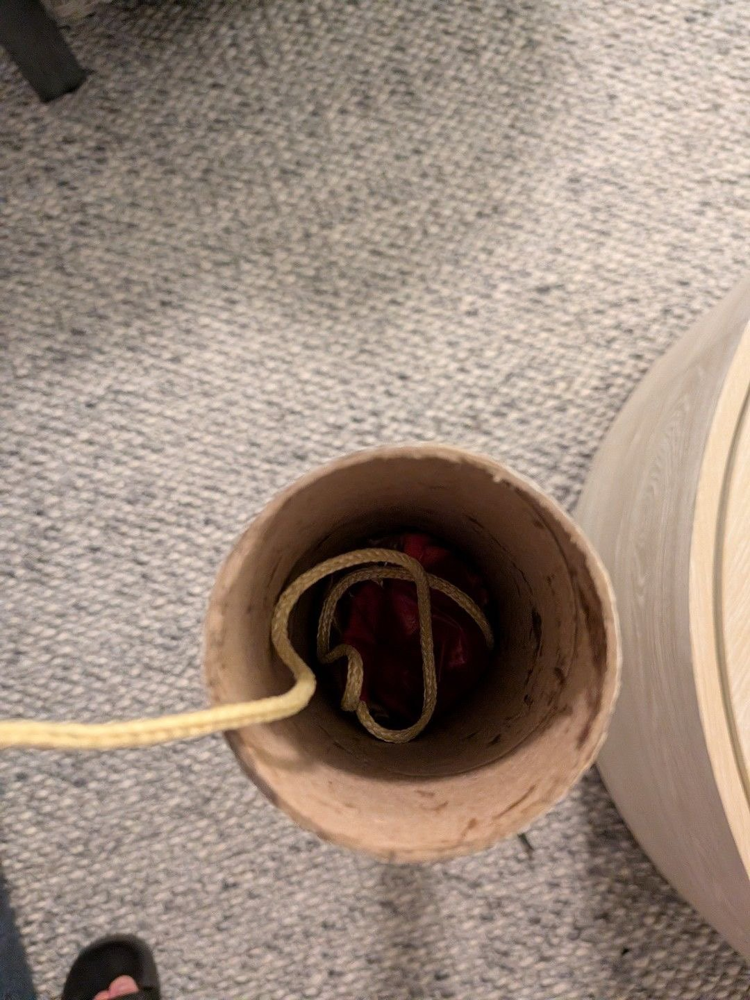

# Star Raptor

*Star Raptor, assembled and standing on its printed fin can.*

---

## What it is

Star Raptor is **my certification rocket**, a vehicle I designed and built on my own to
earn my Canadian Association of Rocketry certification. It is deliberately much simpler
than [the Big Mach](../big-mach/): no avionics, no separation charges, no composites.

It was also a **five-day build**, constrained by when the certification window fell.

That combination (solo, simple, fast) is the whole point of the project, and it is a
different kind of engineering problem from the Big Mach. On a team vehicle you can
specialise. Here every decision was mine and every decision had to be one I could
actually execute alone, at home, inside a week.

*Star Raptor off the stand. Roughly a metre of airframe: printed nose cone, cardboard
body tube, printed five-fin can, with the kevlar shock cord and its anchor visible at
the shoulder.*

---

## The constraint that shaped it

The design rule I set was: **it has to be buildable at home from printed parts and
hardware-store components, with no electronics.**

That single constraint decides most of the vehicle:

| Decision | Why |
|---|---|
| **Motor-ejection recovery, no flight computer** | The propellant grain has an ejection charge built in. If I let the motor deploy the parachute, I need no altimeter, no battery, no e-matches, no charge wells, and nothing to debug in five days. |
| **3D-printed nose cone and fin can** | The two geometrically fussy parts. Printing them meant I could iterate the fin design without tooling, and a printed fin can guarantees fin alignment far better than I could hand-align individual fins on a tube. |
| **Cardboard body tube** | Adequate for the altitude and velocity involved, and available immediately. Composite work would have cost days I didn't have. |
| **U-bolts, kevlar shock cord, off-the-shelf parachute** | Home Depot and hobby-shop parts. Recovery hardware is the one place not to improvise, and buying it removed a whole category of risk. |

The engineering content here is in the **scoping**, not the sophistication. Choosing a
recovery architecture with no failure modes I'd have to test was the decision that made
a five-day build possible.

---

## Build

<table>
<tr>
<td width="50%"></td>
<td width="50%"></td>
</tr>
<tr>
<td colspan="2"><em>Left: the printed fin can, viewed from the aft end down the motor tube. Printing the fin can as a single part fixes the fin alignment in the model instead of during assembly. Right: the nose cone's recovery attachment, a through-bolt anchoring the kevlar shock cord. This joint takes the full deployment shock, so it is bolted through the structure rather than glued.</em></td>
</tr>
</table>

*Looking down the body tube at the packed recovery system: kevlar shock cord running
down to the anchor, parachute packed above it. The motor's ejection charge pressurises
this volume to push the nose cone and parachute out.*

---

## My role

All of it. Design, CAD, printing, assembly, recovery packing, and the certification
flight. No sub-teams, no inherited hardware.

---

## What I took away from it

**Choosing an architecture that removes failure modes beats engineering around them.**
Motor ejection is less impressive than a dual-deploy altimeter setup, and it was
unambiguously the right call. Every electronic component I did not put in the rocket was a
component I did not have to source, wire, mount, power, test, or debug at midnight on day
four. The propellant grain already carried an ejection charge. Using it meant the recovery
system had no failure mode I would have needed a test campaign to characterise, and a test
campaign was exactly what I did not have time for.

**Print the parts where alignment matters.** A one-piece fin can moves fin alignment out
of assembly, where I could get it wrong with glue and a squint, and into the model, where
it is a constraint I cannot violate. The same logic picked the nose cone. Those were the
two geometrically fussy parts, and printing them meant I could iterate the shape without
tooling and without a jig.

**Scope is the engineering.** There is nothing sophisticated in this vehicle. The
sophistication was in deciding what not to build. Given five days, solo, at home, the
design question was not "what is the best rocket I can draw" but "what is the best rocket
I can finish", and those have very different answers. Working out which corners were safe
to cut, and which one (recovery hardware) to spend real money on rather than improvise,
was the part that actually required judgement.

**This was the transition project.** Before this, most of my work was software and
algorithmic. Star Raptor was the first thing I designed, manufactured and flew end to end
myself. Getting a physical object through that whole loop, including the parts that are
just tedious, is what made the hardware work that followed possible: the Big Mach, and
[the quadruped](https://github.com/BentoOre0/Modded-Nova-SM3).
